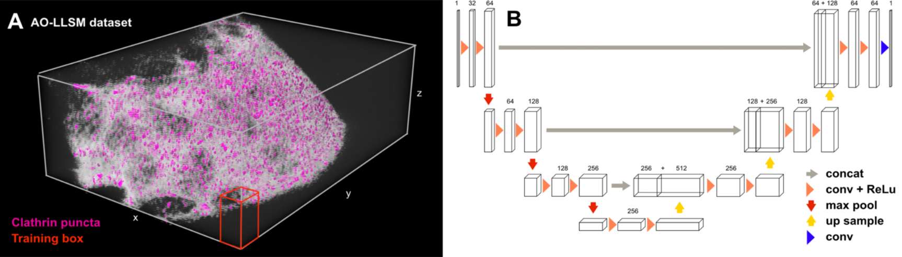
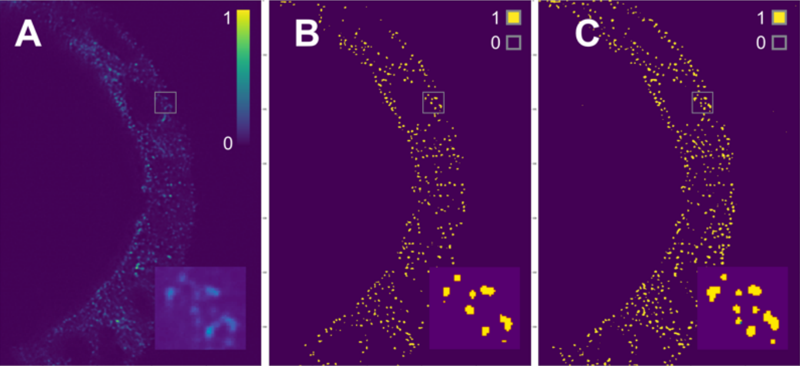

# pyLattice_deepLearning

Patch-Trained 3D U-Nets for Binary Segmentation. 3 Clear Jupyter Notebooks.



pyLattice_deepLearning was created to segment puncta in 3D microscopy data. However, our Jupyter Notebooks will walk you through training a 3D U-Net on data of your choice. Since our microscopy data was highly skewed, we developed code to split images into cube patches (x,y,z), discard patches with low or no signal, and train on the remaining patches. For predictions, our code once again splits the image into cube patches, performs segmentation within each patch, and stitches the patches together for the final output. Therefore, the trained U-Nets can segment images with large arbitrary dimensions (x,y,z), given that these images have the same resolution as the training data.  

## Getting Started

### Prerequisites
* Anaconda (python 3.*)

### Installing

1. Clone this repository
```
$ git clone https://github.com/JohSchoeneberg/pyLattice_deepLearning
```
2. Setup a new Conda environment (Windows users need to do this on Anaconda Prompt)
```
$ cd pyLattice_deepLearning
$ conda create -n pyLattice_3D_env
$ conda activate pyLattice_3D_env
$ conda install pip=19.2
$ pip install -r requirements.txt
$ jupyter-notebook
```

## Usage

Run our quickstart notebooks! Look for comments in the notebook to guide you as you train the model.



A: Raw Data B: Ground Truth C: Prediction

### Preprocessing ([quickstart-1GenData.ipynb](https://github.com/JohSchoeneberg/pyLattice_deepLearning/blob/master/src/quickstart-1GenData.ipynb))

This notebook generates and saves cube patches from the training data you provide.

Prior to running this notebook, create 2 folders under ```pyLattice_deepLearning/src/```
1. ```pyLattice_deepLearning/src/quickstart-data/```
2. ```pyLattice_deepLearning/src/quickstart-gendata/```

Currently our code supports grayscale images. If you're looking to use RGB images, you'll need to edit how the numpy arrays are handled in [generator.py](https://github.com/JohSchoeneberg/pyLattice_deepLearning/blob/master/src/generator.py), [predict.py](https://github.com/JohSchoeneberg/pyLattice_deepLearning/blob/master/src/predict.py), and [visualize.py](https://github.com/JohSchoeneberg/pyLattice_deepLearning/blob/master/src/visualize.py), in addition to the 3 Jupyter Notebooks.

### Training ([quickstart-2Unet3D.ipynb](https://github.com/JohSchoeneberg/pyLattice_deepLearning/blob/master/src/quickstart-2Unet3D.ipynb))

This notebook trains a 3D U-Net.

### Predicting ([quickstart-3Load_Model.ipynb](https://github.com/JohSchoeneberg/pyLattice_deepLearning/blob/master/src/quickstart-3Load_Model.ipynb))

This notebook loads a 3D U-Net from the weights and exports the prediction.

## Authors

* **Joh Schoeneberg** - *Post Doc* - [Website](https://www.schoeneberglab.org)
* **Gautham Raghupathi** - *High School Intern* - [LinkedIn](https://www.linkedin.com/in/gurugautham/)
  
## References
If you use our code, please consider citing: 
```
@inproceedings{schöneberg_raghupathi,
  author={Schöneberg, Johannes and Raghupathi, Gautham and Betzig, Eric and Drubin, David},
  title={3D Deep Convolutional Neural Networks in Lattice Light-Sheet Data Puncta Segmentation},
  booktitle={2019 IEEE International Conference on Bioinformatics and Biomedicine (BIBM)},
  year={2019}
  pages={2369–2372}
}
```
[https://doi.org/10.1109/BIBM47256.2019.8983012](https://doi.org/10.1109/BIBM47256.2019.8983012)

## License
[BSD-3-Clause License](https://github.com/JohSchoeneberg/pyLattice_deepLearning/blob/master/LICENSE)
